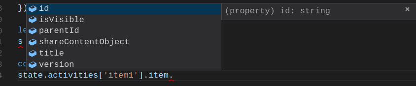

# Rewrite Scooter using Fancy JS stuff
By Mehdi Zonjy

---
## Content
1. Current Challenges
2. New Tooling
3. Demo
4. Improvements
---
## Challenges
Outdated Tooling
+++
## Challenges
Hard to test
``` javascript
const window.$ = window.jQuery = require('jquery/dist/jquery');

if (!(global && global.test))
        require('materialize-css/dist/js/materialize.js');
export const playSCOPackage = (scoPage) => {
    $('#playerIframe').attr('src', scoPage);
    $('#loading-container').fadeOut(500);
};
```
+++
## Challenges
Difficult to maintain as codebase grows
---
## New Tooling
React
``` javascript
export class App extends React.Component {
    render() {
        const { jwtExpired, userIdle } = this.props;

        let content;
        if (jwtExpired)
            content = <ErrorMessage message={JWT_EXPIRED_MESSAGE} />;
        else if (userIdle)
            content = <ErrorMessage message={IDLE_SESSION_SUSPENDED} />;
        else
            content = <CurrentActivity />
        return (
            <div>
                <Header />
                {content}
            </div>
        );
    }
}
```
+++
## New Tooling
React
``` javascript
describe('App', ()=>{
    it('renders CurrentActivity when jwt has not expired and user is not idle', () => {
        const { wrapper } = (<App jwtExpired={false} userIdle{false}/>);
        expect(wrapper.find(CurrentActivity)).to.have.length(1);
        expect(wrapper.find(ErrorMessage)).to.have.length(0);
    });
});
```
+++
## New Tooling
Redux


+++
## New Tooling
Redux


+++
## New Tooling
Redux-Saga
``` javascript
function* tokenCheck(action: AuthTypes.AuthAction) {
    const task = yield fork(loop, action.payload.jwt);
    yield take([ACTION_CANCEL_TOKEN_CHECK, ACTION_TOKEN_EXPIRED, ACTION_USER_IDLE])
    yield cancel(task);

}

function* waitForAuthAction() {
    const action = yield take(AuthTypes.ACTION_AUTH)
    yield fork(tokenCheck, action);
}
```
+++
## New Tooling
Typescript



---
## Demo
---
## Improvements
Reduce JS bundle Size
+++
## Improvements
Test coverage Almost there


+++
## Improvements
Get ride of blocking sync calls 
+++
## Improvements
Decouple Scooter Frontend and Backend
+++
## Improvements
Make it pretty
---
## Thank You